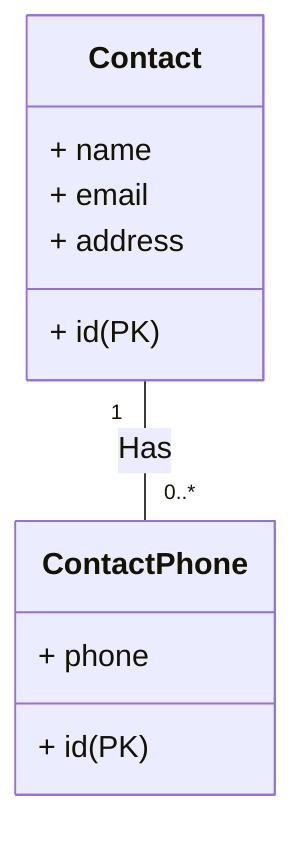

# Phonebook

Phonebook is contacts application, you can create unlimited contacts with unlimited phone numbers.
Django based application.

## Features

- Add contact details associated with phone numbers.
- List all created contacts.
- View contact details with its numbers.

## Tech

Dillinger uses a number of open source projects to work properly:

- [Python]
- [Django] 
- [Docker] 
- [Postgresql] 

And of course Phonebook itself is open source with a [public repository][phonebook]
 on GitHub.

   [phonebook]: <https://github.com/bor3y98/phonebook>
   [Docker]: <https://www.docker.com/>
   [Python]: <https://www.python.org/>
   [Postgresql]: <https://www.postgresql.org/>
   [Django]: <https://github.com/bor3y98/phonebook>

